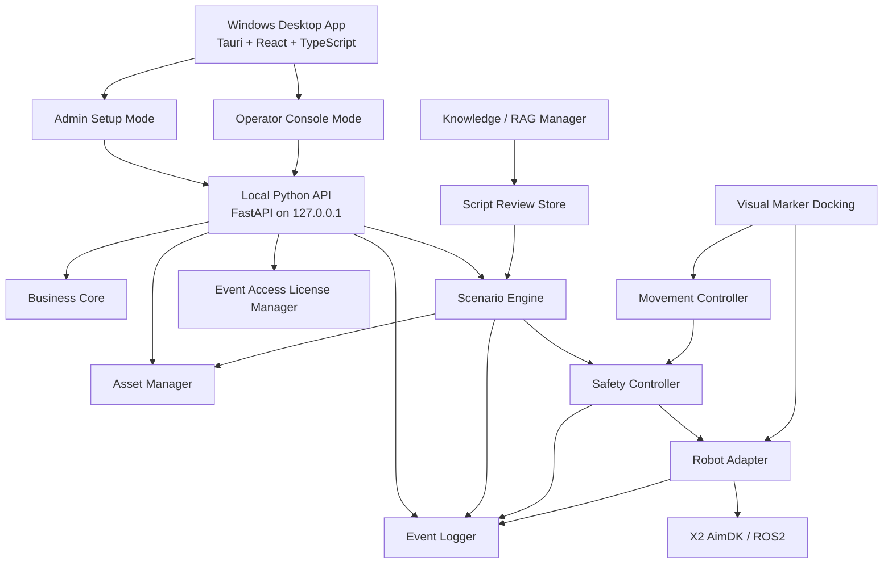

# X2 租赁场景编排平台开发模块拆分

> 来源文档：`X2_Rental_Scenario_Platform_Practical_Plan.md`  
> 生成日期：2026-07-03  
> 目标：把 X2 租赁场景编排平台拆成低耦合、可独立开发、可独立测试、可逐阶段交付的开发模块。

---

## 1. 拆分原则

本平台的核心不是“写几个活动脚本”，而是把活动交付能力产品化。因此模块边界必须围绕稳定接口划分，而不是围绕单次活动需求划分。

### 1.1 核心原则

```text
后台负责配置
平板负责现场控制
场景引擎负责流程编排
安全控制负责最终拦截
机器人适配器负责执行 X2 能力
素材、话术、授权、日志各自独立管理
```

### 1.2 禁止耦合规则

```text
1. Admin Portal 不直接调用 Robot Adapter。
2. Tablet Console 不直接调用 ROS2 / AimDK。
3. Scenario Engine 不直接读写本地文件，只引用 Asset ID / Asset URL。
4. Robot Adapter 不知道客户、活动、授权、模板等业务概念。
5. RAG 不直接驱动现场机器人，只生成待审核文本。
6. Movement Controller 不绕过 Safety Controller。
7. Visual Marker Docking 不被包装成完整自主导航。
8. License 检查不能散落在各业务代码里，必须集中在授权模块或统一策略层。
9. 场景模板优先数据化，不把具体客户活动写死进代码。
10. 日志记录不影响主流程执行，失败时可降级但要保留本地队列。
```

### 1.3 开发策略

```text
1. 先做 Mock Robot Adapter，让后台、平板和场景引擎可以不依赖真机开发。
2. 先做 5 个 MVP 场景模板，不一开始覆盖全部 8 个模板。
3. 先做人工可控现场流程，不承诺全自动。
4. 先做 X2 原生 TTS，不先做 voice cloning。
5. 先做 RAG 生成话术，不做实时自由问答主链路。
6. 先做受控移动脚本，再做视觉 marker 最后校准。
```

---

## 2. 推荐总架构

当前执行结论：第一版做成 **Windows 桌面 App**，不做浏览器访问为主的网页版。桌面 App 内包含两个工作模式：后台配置模式和现场控制模式；它通过本机 HTTP 调用 Local Python API，再由本地服务进入场景引擎、安全控制和机器人适配层。



### 2.1 分层

```text
Layer 1: Windows Desktop Shell
- 桌面入口、后台配置模式、现场控制模式、本地 API 状态检查

Layer 2: Local Business Configuration
- 客户、活动、授权、素材、话术、场景模板配置

Layer 3: Scenario Runtime
- 触发器、流程、步骤、动作队列、失败兜底、现场控制

Layer 4: Robot Capability
- TTS、音频、视频、表情、LED、动作、移动、状态读取、紧急停止
```

---

## 3. 原始需求模块映射

原始方案中的模块不一定都应该作为独立服务开发。部分模块更适合拆成“数据配置 + 场景编排 + 机器人执行能力”，这样可以减少耦合。

| 原始模块 | 开发模块归属 | 拆分说明 |
|---|---|---|
| Admin Portal | Module H | 只做后台配置 UI，通过 API 调用业务、素材和场景模块 |
| Tablet Control Console | Module I | 只做现场控制 UI，通过 Scenario API 和 Safety API 执行 |
| Scenario Engine | Module E | 独立运行场景状态机、动作队列和失败兜底 |
| Robot Adapter | Module G | 封装 X2 AimDK / ROS2，不包含业务概念 |
| Asset Manager | Module C | 管理素材文件、话术和素材引用 |
| Speech Manager | Module C + Module G + Module K | 话术存储在 C，TTS / 音频播放在 G，RAG 生成在 K |
| Screen Manager | Module C + Module D + Module G | 屏幕素材在 C，模板引用在 D，播放执行在 G |
| Motion Manager | Module D + Module F + Module G | 模板选择动作，Safety 检查动作互斥，Robot Adapter 执行动作 |
| Movement Controller | Module M | 第三阶段独立实现，必须经过 Safety Controller |
| Visual Marker Docking | Module N | 第四阶段独立实现，不包装成自主导航 |
| Knowledge / RAG Manager | Module K + Module L | K 负责生成和审核，L 负责 FAQ 场景化使用 |
| Event Access License Manager | Module B | 统一管理授权和执行权限校验 |
| Event Logger | Module J | 独立记录操作、执行、安全和错误日志 |
| Safety Controller | Module F | 所有机器人动作执行前的安全网关 |

---

## 4. MVP 必须完成的开发模块

MVP 的目标是：租赁公司可以创建客户活动，选择 5 个高频场景模板之一，上传素材，编辑话术，然后由现场人员使用平板控制 X2 完成互动。

### Module A: Core Contracts & Shared Domain

**定位**  
所有模块共用的数据契约和接口定义。这个模块不包含复杂业务逻辑，只定义系统之间如何通信。

**负责内容**

```text
- Client
- Event
- Robot
- License
- Asset
- ScenarioTemplate
- ScenarioVersion
- ScenarioRun
- ScenarioStep
- RobotAction
- RobotStatus
- EventLog
```

**对外产物**

```text
- OpenAPI schema
- JSON schema
- TypeScript types
- Python Pydantic models
- 统一错误码
- 统一状态枚举
```

**禁止负责**

```text
- 不负责页面 UI
- 不负责机器人执行
- 不负责素材存储
- 不负责授权判断逻辑
```

**依赖**

```text
无业务依赖，是其他模块的基础。
```

**建议优先实现的核心契约**

```json
{
  "command_id": "cmd_001",
  "event_id": "event_001",
  "robot_id": "X2U-001",
  "action_type": "tts",
  "payload": {
    "text": "大家好，欢迎来到 ABC Tech 的产品发布会。"
  },
  "priority": 6,
  "timeout_ms": 30000,
  "idempotency_key": "event_001_opening_tts"
}
```

**验收标准**

```text
- 前端、后端、场景引擎、机器人适配器都使用同一份字段定义。
- 任何机器人动作都可以被序列化为 RobotAction。
- 新增动作类型时不需要修改 Admin Portal 和 Tablet Console 的核心流程。
```

---

### Module B: Business Core & License Manager

**定位**  
负责租赁业务对象和授权规则，是 Rental Business Layer 的核心。

**负责内容**

```text
- 客户管理
- 活动管理
- 机器人绑定
- 按天 / 按周授权
- Founder Partner 价格标签
- 授权状态判断
- 活动复制
- 到期后的只读策略
```

**核心数据**

```text
- Client
- Event
- RobotBinding
- EventAccessLicense
- LicensePolicy
```

**对外接口**

```text
POST /clients
GET /clients
POST /events
GET /events/{event_id}
POST /events/{event_id}/copy
POST /licenses
GET /licenses/{event_id}/status
POST /licenses/{event_id}/validate-action
```

**模块边界**

```text
- 只判断某活动是否有权执行，不执行机器人动作。
- 只保存业务授权数据，不保存素材文件。
- 不关心场景步骤细节，只关心 event_id、robot_id、start_date、end_date、status。
```

**依赖**

```text
依赖 Module A 的共享契约。
不依赖 Scenario Engine、Robot Adapter、Admin Portal、Tablet Console。
```

**验收标准**

```text
- 可创建客户、活动和授权。
- 授权过期后，执行类 API 返回明确的 license_expired 错误。
- 后台仍可查看历史活动。
- 活动可以复制成新活动，但复制后必须重新绑定授权。
```

---

### Module C: Asset & Script Manager

**定位**  
负责活动素材和话术管理。场景引擎只引用素材，不直接处理上传、转码、目录结构和存储细节。

**负责内容**

```text
- Logo 上传
- 图片上传
- 视频上传
- 二维码上传
- 音频上传
- TTS 文案保存
- 多语言话术保存
- 素材元数据管理
- 素材可用性校验
```

**建议目录结构**

```text
/client_id/event_id/assets/
├── logo/
├── videos/
├── images/
├── audio/
├── qr/
└── scripts/
```

**核心数据**

```text
- Asset
- AssetVariant
- Script
- ScriptVersion
- LanguageVariant
```

**对外接口**

```text
POST /events/{event_id}/assets
GET /events/{event_id}/assets
GET /assets/{asset_id}
DELETE /assets/{asset_id}
POST /events/{event_id}/scripts
GET /events/{event_id}/scripts
POST /scripts/{script_id}/versions
```

**模块边界**

```text
- 不决定某一步播放什么动作。
- 不调用机器人。
- 不执行 RAG。
- 不判断授权。
- 只返回 asset_id、url、mime_type、duration、metadata。
```

**依赖**

```text
依赖 Module A 的共享契约。
可读取 Module B 的 event_id 是否存在。
不依赖 Scenario Engine 和 Robot Adapter。
```

**验收标准**

```text
- 每个活动可以上传并管理素材。
- 场景配置中可以稳定引用 asset_id。
- 删除素材前能检查是否被场景模板引用。
- 脚本文案支持中英双语和版本记录。
```

---

### Module D: Scenario Template Pack

**定位**  
负责把高频活动能力做成可复用模板。模板优先是数据和配置，不是硬编码业务流程。

**MVP 模板**

```text
1. Welcome Reception
2. Product Presenter
3. Event MC
4. Photo Booth
5. Lucky Draw
```

**后续模板**

```text
6. AI FAQ
7. Guided Exhibit
8. Ceremony Launch
```

**每个模板必须定义**

```text
- template_id
- template_name
- required_assets
- required_scripts
- configurable_fields
- default_steps
- available_tablet_buttons
- supported_languages
- supported_robot_actions
- fallback_behavior
```

**示例模板字段**

```json
{
  "template_id": "product_presenter",
  "template_name": "Product Presenter",
  "required_assets": ["product_image_or_video"],
  "required_scripts": ["product_intro_30s"],
  "configurable_fields": [
    "product_name",
    "language",
    "duration",
    "screen_asset_id",
    "motion_id",
    "emoji_id"
  ],
  "available_tablet_buttons": [
    "start",
    "next",
    "replay",
    "stop",
    "switch_product",
    "switch_language"
  ]
}
```

**模块边界**

```text
- 只定义模板，不负责执行。
- 不直接访问数据库以外的文件。
- 不直接调用 Robot Adapter。
- 不处理授权。
```

**依赖**

```text
依赖 Module A 的模板契约。
依赖 Module C 的素材和话术引用。
被 Module E Scenario Engine 读取和执行。
```

**验收标准**

```text
- 5 个 MVP 模板都可以被后台选择。
- 每个模板都能生成可执行的 ScenarioVersion。
- 模板缺少必要素材或话术时，后台给出明确提示。
```

---

### Module E: Scenario Engine

**定位**  
平台核心编排引擎。它把触发器、流程、素材和机器人动作编排成可运行的现场流程。

**负责内容**

```text
- 场景版本发布
- 场景运行实例 ScenarioRun
- 单步播放
- 下一步 / 上一步
- 重播
- 停止
- 优先级打断
- 超时处理
- 失败兜底
- 动作队列
- 状态机
```

**核心抽象**

```text
Trigger + Flow + Assets + Robot Actions + External Integrations
```

**对外接口**

```text
POST /events/{event_id}/scenarios/{scenario_id}/publish
POST /runs
GET /runs/{run_id}
POST /runs/{run_id}/start
POST /runs/{run_id}/next
POST /runs/{run_id}/previous
POST /runs/{run_id}/replay
POST /runs/{run_id}/stop
POST /runs/{run_id}/trigger
```

**模块边界**

```text
- 不直接调用 ROS2 / AimDK。
- 不保存原始素材文件。
- 不做 UI。
- 不做 RAG 生成。
- 不绕过 Safety Controller。
```

**依赖**

```text
依赖 Module A 的动作契约。
依赖 Module B 的授权校验。
依赖 Module C 的素材和话术引用。
依赖 Module D 的模板定义。
通过 Module F Safety Controller 发送动作。
向 Module I Event Logger 写入运行日志。
```

**验收标准**

```text
- 可以发布一个活动场景版本。
- 平板可以控制开始、下一步、上一步、重播、停止。
- 执行动作前会检查授权。
- 执行动作失败时有明确 fallback。
- 使用 Mock Robot Adapter 时可以完整跑通 5 个 MVP 模板。
```

---

### Module F: Safety Controller

**定位**  
所有现场执行动作的最终安全网关。任何会影响机器人现场行为的命令都必须经过它。

**负责内容**

```text
- 紧急停止
- 停止当前互动
- 网络断开自动停止
- 机器人状态异常拦截
- 低电量拦截
- 非稳定站立状态拦截
- 移动速度上限
- 角速度上限
- 移动前提示策略
- 动作互斥规则
```

**对外接口**

```text
POST /safety/validate-action
POST /safety/emergency-stop
POST /safety/stop-current
GET /safety/status/{robot_id}
```

**模块边界**

```text
- 不决定业务流程下一步是什么。
- 不管理客户和活动。
- 不保存素材。
- 不实现具体 AimDK 调用。
- 不做视觉识别。
```

**依赖**

```text
依赖 Module A 的 RobotAction 和 RobotStatus。
调用 Module G Robot Adapter。
向 Module I Event Logger 写安全日志。
```

**验收标准**

```text
- 所有机器人动作都能被 safety policy 检查。
- emergency_stop 可以打断当前执行。
- 网络断开、低电量、状态异常时拒绝移动类动作。
- 移动类动作和复杂上肢动作不能同时执行。
```

---

### Module G: Robot Adapter

**定位**  
封装 X2 AimDK / ROS2，不让上层业务直接接触机器人底层能力。

**负责内容**

```text
- play_tts
- play_audio
- play_video
- play_emoji
- play_led
- play_motion
- play_linkcraft
- set_volume
- stop_current
- get_robot_status
- send_velocity
```

**建议接口**

```python
play_tts(text, priority=6)
play_audio(file_path, priority=6)
play_video(file_path, priority=5)
play_emoji(emoji_id, priority=5)
play_led(config)
play_motion(motion_id)
play_linkcraft(action_id)
set_volume(value)
stop_current()
get_robot_status()
send_velocity(forward, lateral, yaw_rate)
```

**实现形态**

```text
1. MockRobotAdapter: 本地开发和自动化测试使用。
2. X2RobotAdapter: 对接真实 X2 AimDK / ROS2。
3. RobotStatusMonitor: 周期读取机器人状态。
```

**模块边界**

```text
- 不知道客户和活动。
- 不判断授权。
- 不编排场景流程。
- 不做后台页面。
- 不决定安全策略，只执行经过 Safety Controller 放行的命令。
```

**依赖**

```text
依赖 Module A 的 RobotAction 契约。
被 Module F Safety Controller 调用。
向 Module I Event Logger 写执行结果。
```

**验收标准**

```text
- MockRobotAdapter 可以返回稳定的 command_receipt。
- X2RobotAdapter 可以执行 TTS、表情、视频、预设动作、音量、停止。
- get_robot_status 至少返回 online、battery、pose_available、is_stable、current_action。
- send_velocity 有硬限制，不能发送超过安全上限的速度。
```

---

### Module H: Admin Setup Mode

**定位**  
Windows 桌面 App 内的后台配置模式，给租赁公司后台人员使用。它负责把活动配置完整，但不负责现场执行。

**负责页面**

```text
- 客户列表
- 客户详情
- 活动列表
- 活动详情
- 授权状态
- 场景模板选择
- 模板配置表单
- 素材上传
- 话术编辑
- 产品介绍配置
- 抽奖配置
- 活动流程预览
- 发布到现场控制模式
```

**模块边界**

```text
- 不直接调用 Robot Adapter。
- 不直接执行现场动作。
- 不自己保存业务状态，全部通过 Local Python API。
- 不实现 Scenario Engine 逻辑，只展示预览和配置结果。
```

**依赖**

```text
依赖 Module A 的前端类型。
调用 Module B、C、D、E 的 API。
显示 Module I 的部分日志。
```

**验收标准**

```text
- 后台可以完成一个活动从创建到发布的全流程。
- 未配置完整的模板不能发布。
- 活动授权状态在后台清晰可见。
- 预览内容和发布到平板的内容一致。
```

---

### Module I: Tablet Control Console

**定位**  
Windows 桌面 App 内的现场控制模式，给现场工作人员使用。它是现场主入口，但不直接控制机器人底层。

**负责页面和控件**

```text
- 当前客户 / 当前活动
- 当前场景模板
- 开始
- 下一步
- 上一步
- 重播
- 停止
- 静音
- 音量调节
- 切换产品
- 切换语言
- 触发动作
- 紧急停止当前互动
- 查看机器人状态
```

**设计原则**

```text
现场不能完全自动化，必须让工作人员可以控节奏。
```

**模块边界**

```text
- 不直接调用 ROS2 / AimDK。
- 不保存活动配置。
- 不生成 RAG 内容。
- 不编辑复杂后台配置。
- 不绕过授权和 Safety Controller。
```

**依赖**

```text
依赖 Module A 的前端类型。
调用 Module E Scenario Engine 的运行 API。
调用 Module F Safety Controller 的 emergency stop API。
读取 Module G Robot Adapter 暴露的状态汇总。
读取 Module B 的授权状态。
```

**验收标准**

```text
- 工作人员可以控制 5 个 MVP 模板的现场流程。
- 授权过期时不能开始执行，但能看到明确原因。
- emergency_stop 永远可见且可触发。
- 机器人离线时按钮进入禁用或降级状态。
```

---

### Module J: Event Logger & Observability

**定位**  
记录活动配置、现场执行、机器人动作、安全拦截和错误，方便复盘、远程支持和商业化交付。

**负责内容**

```text
- 活动操作日志
- 场景运行日志
- 机器人命令日志
- 安全拦截日志
- 错误日志
- 授权检查日志
- 简单导出
```

**核心数据**

```text
- EventLog
- CommandLog
- SafetyLog
- ErrorLog
- AuditLog
```

**对外接口**

```text
POST /logs
GET /events/{event_id}/logs
GET /runs/{run_id}/logs
GET /robots/{robot_id}/command-logs
```

**模块边界**

```text
- 不影响主流程成功或失败。
- 不做业务判断。
- 不调用机器人。
- 不保存大文件素材。
```

**依赖**

```text
依赖 Module A 的日志契约。
被 Business Core、Scenario Engine、Safety Controller、Robot Adapter 调用。
```

**验收标准**

```text
- 每次平板操作都有日志。
- 每个机器人动作都有 command_id 和执行结果。
- 安全拦截原因可追踪。
- 活动结束后可以导出基础日志。
```

---

## 5. 第二阶段开发模块

第二阶段不应阻塞 MVP。它们通过前面定义的契约接入，避免破坏主链路。

### Module K: Knowledge / RAG Manager

**定位**  
负责产品文档导入、简介生成、FAQ 草稿生成。第一版只生成文字，不做现场实时自由发挥。

**负责内容**

```text
- Dify Knowledge Base 配置
- 产品文档导入记录
- 产品简介生成
- 30 秒 / 60 秒 / 90 秒版本
- 多语言生成
- 人工审核
- 保存到 Script Manager
```

**推荐流程**

```text
产品 PDF / Word / PPT
↓
Dify / RAG 知识库
↓
生成产品简介
↓
人工审核
↓
保存到活动话术
↓
平板点击产品
↓
X2 使用原生 TTS 播放
```

**模块边界**

```text
- 不直接调用机器人。
- 不直接进入现场实时问答主链路。
- 不绕过人工审核。
- 不保存为最终话术前，不影响已发布活动。
```

**依赖**

```text
依赖 Module C 的 Script Manager。
可调用外部 Dify。
被 Admin Portal 使用。
```

**验收标准**

```text
- 可为指定产品生成可审核讲稿。
- 审核通过后写入 ScriptVersion。
- 资料不足时返回明确提示，不编造内容。
```

---

### Module L: FAQ Reception Module

**定位**  
把 FAQ 接待做成独立扩展模块，避免影响 MVP 的 Product Presenter 主链路。

**负责内容**

```text
- FAQ 问题库
- 平板选择问题
- 平板输入问题
- 手机扫码提问入口
- 回答文本审核
- FAQ 回答播放
```

**模块边界**

```text
- 第一版不依赖机器人内建 ASR。
- 不承诺自由问答 100% 准确。
- 不允许未经审核的答案直接覆盖正式话术。
```

**依赖**

```text
依赖 Module K 的知识生成能力。
依赖 Module C 的脚本保存能力。
通过 Module E 执行播放流程。
```

**验收标准**

```text
- 工作人员可以从平板选择 FAQ 并触发回答。
- 回答通过 X2 原生 TTS 播放。
- 未命中问题时使用固定兜底话术。
```

---

## 6. 第三阶段开发模块

### Module M: Movement Controller

**定位**  
负责受控移动脚本和相对移动控制。它不是完整导航系统。

**负责内容**

```text
- 手动遥控
- Open-loop 时间估算移动
- IMU yaw 闭环转向
- Odom / SLAM pose 相对移动
- 移动脚本
- 移动前语音提醒
- 移动超时停止
```

**核心能力等级**

```text
Level 1: Open-loop 时间估算
Level 2: IMU Yaw 闭环
Level 3: Odom / SLAM Pose 全闭环
```

**模块边界**

```text
- 不做完整自主导航。
- 不绕过 Safety Controller。
- 不与复杂上肢动作并发。
- 不承诺复杂人群避障。
```

**依赖**

```text
依赖 Module F Safety Controller。
通过 Module G Robot Adapter 发送 send_velocity。
向 Module J 记录移动日志。
```

**验收标准**

```text
- 可执行往前、后退、转向等简单移动脚本。
- 可基于 origin pose 计算相对前向距离。
- 定位丢失、网络断开、超时、低电量时自动停止。
```

---

## 7. 第四阶段开发模块

### Module N: Visual Marker Docking

**定位**  
视觉点位停靠。机器人识别指定 ArUco / AprilTag marker，并移动到 marker 附近停止。

**负责内容**

```text
- 相机 topic 探测
- RGB 图像读取
- Depth 图像读取
- Camera info 读取
- ArUco / AprilTag 检测
- marker_id 识别
- marker 相对位置估算
- 最后 0.8m 到 1.0m 视觉校准
- marker 丢失停止
```

**推荐策略**

```text
预设路线快速接近
↓
最后 0.8m 到 1.0m 开启 marker 对准
↓
距离 marker 约 0.5m 停止
```

**模块边界**

```text
- 不叫自主导航。
- 不承诺精准踩到 marker 中心。
- 不绕过 Movement Controller。
- 不绕过 Safety Controller。
```

**依赖**

```text
依赖 Module M Movement Controller。
依赖 Module G Robot Adapter 的相机 topic 和速度控制。
依赖 Module F Safety Controller。
```

**验收标准**

```text
- 可以识别指定 marker_id。
- marker 偏左或偏右时可以转向修正。
- marker 接近中心时可以慢速前进。
- marker 丢失时立即停止。
- 到达 stop_distance 后停止并返回 docking_completed。
```

---

## 8. 第五阶段开发模块

### Module O: Multi-Robot & Commercialization

**定位**  
面向正式商业化后的多活动、多机器人、多品牌管理。

**负责内容**

```text
- 多机器人绑定
- Extra Robot 授权
- 活动包管理
- 白标配置
- 远程诊断
- 日志导出增强
- 多租赁公司隔离
```

**模块边界**

```text
- 不改变单机器人 MVP 主链路。
- 不把白标逻辑写死到 Admin Portal。
- 不让多机器人调度影响单机器人稳定性。
```

**依赖**

```text
依赖 Module B 的授权模型扩展。
依赖 Module G 的 robot_id 抽象。
依赖 Module J 的日志和诊断数据。
```

**验收标准**

```text
- 一个活动可绑定多台机器人。
- 授权可以按 robot_id 单独判断。
- 白标主题可配置，不需要重新部署前端。
- 支持按活动导出日志和执行记录。
```

---

## 9. 建议仓库结构

```text
x2-rental-platform/
├── windows-app/
│   ├── src/
│   └── src-tauri/
├── local-api/
│   ├── app/
│   └── tests/
├── services/
│   ├── scenario-engine/
│   ├── safety-controller/
│   ├── robot-adapter/
│   └── worker/
├── packages/
│   ├── contracts/
│   ├── scenario-templates/
│   └── ui-shared/
├── robot/
│   └── x2-ros2-adapter/
├── storage/
│   └── local-dev/
├── docs/
│   ├── architecture/
│   ├── api/
│   └── operations/
└── tests/
    ├── contract/
    ├── integration/
    └── e2e/
```

### 9.1 目录职责

```text
windows-app
- Windows 桌面 App，包含后台配置模式和现场控制模式

windows-app/src-tauri
- Tauri 打包配置，后续用于生成 Windows 安装包 / .exe

local-api
- 本机 FastAPI 服务，负责业务聚合、权限入口、本地状态和桌面 App 调用接口

services/scenario-engine
- 场景运行、动作队列、流程状态机

services/safety-controller
- 执行动作前的安全检查和紧急停止

services/robot-adapter
- MockRobotAdapter 和 X2RobotAdapter

packages/contracts
- OpenAPI、JSON schema、前后端共享类型

packages/scenario-templates
- 5 个 MVP 模板和后续模板定义

robot/x2-ros2-adapter
- X2 侧 ROS2 / AimDK 对接代码
```

---

## 10. 模块依赖矩阵

| 模块 | 可依赖 | 禁止依赖 |
|---|---|---|
| Core Contracts | 无 | 所有业务模块 |
| Business Core & License | Core Contracts | Robot Adapter、UI、RAG |
| Asset & Script Manager | Core Contracts、Business Core | Robot Adapter、Scenario Runtime |
| Scenario Template Pack | Core Contracts、Asset 引用 | Robot Adapter、License 实现 |
| Scenario Engine | Contracts、License、Asset、Template、Logger | ROS2 / AimDK 直接调用 |
| Safety Controller | Contracts、RobotStatus、Logger | Admin Portal、业务配置页面 |
| Robot Adapter | Contracts、X2 AimDK / ROS2 | Client、Event、License、Template |
| Admin Portal | Backend API、Contracts | Robot Adapter、ROS2 / AimDK |
| Tablet Console | Scenario API、Safety API、Contracts | Robot Adapter、数据库 |
| Event Logger | Contracts | UI、机器人动作执行 |
| RAG Manager | Asset & Script Manager、Dify | Robot Adapter、现场实时执行 |
| Movement Controller | Safety、Robot Adapter | Admin Portal、RAG |
| Visual Marker Docking | Movement、Safety、Robot Adapter | Business Core、Admin Portal |
| Multi-Robot | Business Core、Robot Adapter、Logger | 单机器人流程硬编码 |

---

## 11. 推荐开发顺序

### Phase 0: 项目骨架和契约

```text
1. 建立仓库结构。
2. 定义 Core Contracts。
3. 建立 MockRobotAdapter。
4. 建立基础 API 服务。
5. 建立本地开发数据库和文件存储。
```

**完成标志**

```text
前后端可以共享类型，后端可以向 MockRobotAdapter 发送一条 TTS 动作并获得模拟结果。
```

### Phase 1: MVP 基础平台

```text
1. Business Core & License Manager
2. Asset & Script Manager
3. Scenario Template Pack 的 5 个 MVP 模板
4. Scenario Engine
5. Safety Controller
6. Robot Adapter 的 TTS / 视频 / 表情 / 动作 / 停止 / 音量
7. Admin Portal
8. Tablet Control Console
9. Event Logger
```

**完成标志**

```text
租赁公司可以创建活动、上传素材、配置话术、发布场景，并由平板控制 X2 或 Mock X2 完成 5 个 MVP 模板。
```

### Phase 2: 产品介绍增强

```text
1. Knowledge / RAG Manager
2. Dify 文档导入记录
3. 产品简介生成
4. 人工审核
5. 多语言话术版本
6. FAQ Reception Module
```

**完成标志**

```text
产品文档可以生成可审核讲稿，审核通过后进入 Product Presenter 或 FAQ 场景。
```

### Phase 3: 移动能力

```text
1. 手动遥控
2. Open-loop 移动脚本
3. IMU yaw 闭环转向
4. Odom / SLAM pose 相对移动
5. 移动安全策略
```

**完成标志**

```text
工作人员可以在平板触发简单受控移动，并且任何异常都会停止。
```

### Phase 4: 视觉点位停靠

```text
1. 相机 topic 探测
2. ArUco / AprilTag 识别
3. RGB-D 距离估算
4. 视觉闭环靠近
5. marker 丢失停止
```

**完成标志**

```text
机器人可以识别指定 marker，并在 marker 附近安全停止。
```

### Phase 5: 商业化增强

```text
1. 多机器人管理
2. Extra Robot 授权
3. 活动包管理
4. 白标配置
5. 远程诊断
6. 日志导出增强
```

**完成标志**

```text
平台可以支持多个租赁公司、多个活动和多台机器人，且不破坏单机器人 MVP 主链路。
```

---

## 12. MVP 开发边界

### 12.1 MVP 必须包含

```text
- 客户管理
- 活动管理
- 按天 / 按周授权
- 场景模板选择
- 话术编辑
- 素材上传
- 平板控制台
- TTS
- 表情
- 屏幕视频
- 预设动作
- 停止 / 重播 / 音量控制
- 日志记录
- 5 个高频场景模板
```

### 12.2 MVP 不包含

```text
- voice cloning
- 实时自由问答主链路
- 任意环境自主导航
- 多机器人调度
- 复杂视觉定位现场调试
- 白标后台
- 复杂第三方系统对接
- 自动避开复杂人群
```

### 12.3 MVP 预留接口但不实现完整能力

```text
- RAG 预留 ScriptSource 字段
- Movement 预留 action_type: locomotion
- Visual Marker 预留 trigger_type: marker_detected
- Multi-Robot 预留 robot_id
- White Label 预留 tenant_theme
```

---

## 13. 每个模块的测试策略

### 13.1 Contract Tests

```text
目标：确保前端、后端、场景引擎、机器人适配器使用同一套字段。

覆盖：
- RobotAction schema
- ScenarioTemplate schema
- ScenarioRun status
- RobotStatus schema
- Error code schema
```

### 13.2 Unit Tests

```text
目标：每个模块内部逻辑可单独验证。

覆盖：
- 授权时间判断
- 模板必填项校验
- 场景状态机
- Safety policy
- Asset 引用检查
- RAG 输出保存规则
```

### 13.3 Integration Tests

```text
目标：模块之间通过正式接口联调。

覆盖：
- Admin 创建活动到发布场景
- Tablet 触发 ScenarioRun
- Scenario Engine 调 Safety Controller
- Safety Controller 调 MockRobotAdapter
- RobotAdapter 返回 command_receipt
- Event Logger 记录全过程
```

### 13.4 Hardware Tests

```text
目标：只验证 Robot Adapter 和 Movement / Marker 相关能力。

覆盖：
- X2 原生 TTS
- 视频播放
- 表情播放
- 预设动作
- 停止当前动作
- 音量控制
- send_velocity 上限
- robot_status 读取
```

### 13.5 Field Rehearsal Tests

```text
目标：真实活动前验证现场流程。

覆盖：
- 网络断开
- 授权过期
- 低电量
- 素材缺失
- 平板误触停止
- 重播和下一步
- emergency_stop
```

---

## 14. 关键接口建议

### 14.1 RobotAction

```json
{
  "command_id": "cmd_001",
  "run_id": "run_001",
  "event_id": "event_001",
  "robot_id": "X2U-001",
  "action_type": "tts",
  "payload": {
    "text": "欢迎来到活动现场。"
  },
  "priority": 6,
  "timeout_ms": 30000,
  "idempotency_key": "run_001_step_001_tts"
}
```

### 14.2 ScenarioStep

```json
{
  "step_id": "opening",
  "display_name": "开场欢迎",
  "actions": [
    {
      "action_type": "screen_video",
      "asset_id": "asset_logo_video",
      "priority": 5
    },
    {
      "action_type": "motion",
      "motion_id": "wave"
    },
    {
      "action_type": "tts",
      "script_id": "script_opening_zh",
      "priority": 6
    }
  ],
  "on_error": {
    "strategy": "speak_fallback_and_continue",
    "fallback_script_id": "script_default_error"
  }
}
```

### 14.3 RobotStatus

```json
{
  "robot_id": "X2U-001",
  "online": true,
  "battery_percent": 82,
  "is_stable": true,
  "pose_available": true,
  "network_ok": true,
  "current_action": "tts",
  "last_seen_at": "2026-07-03T16:30:00+08:00"
}
```

### 14.4 LicenseStatus

```json
{
  "event_id": "abc_product_launch",
  "robot_id": "X2U-001",
  "license_type": "weekly",
  "start_date": "2026-07-01",
  "end_date": "2026-07-07",
  "status": "active",
  "can_execute_robot_action": true
}
```

---

## 15. 后续开发执行方式

后续开发不要按页面直接开工，应该按模块和契约推进。

### 15.1 每个模块开工前必须明确

```text
1. 该模块拥有哪些数据。
2. 该模块暴露哪些 API。
3. 该模块依赖哪些模块。
4. 该模块禁止依赖哪些模块。
5. 该模块如何用 Mock 测试。
6. 该模块的完成验收标准。
```

### 15.2 每个模块开发顺序

```text
1. 写契约。
2. 写失败测试。
3. 写最小实现。
4. 接 Mock。
5. 接真实依赖。
6. 写集成测试。
7. 更新文档。
```

### 15.3 首个建议开发包

```text
Development Package 1: MVP Foundation

包含：
- Core Contracts
- Business Core & License Manager
- Asset & Script Manager
- MockRobotAdapter
- Event Logger 基础版

不包含：
- Admin Portal 完整 UI
- Tablet Console 完整 UI
- 真实 X2 对接
- RAG
- 移动
- 视觉停靠
```

### 15.4 第二个建议开发包

```text
Development Package 2: Scenario Runtime

包含：
- Scenario Template Pack 的 5 个 MVP 模板
- Scenario Engine
- Safety Controller
- Tablet Console 基础控制流
- Admin Portal 发布流程

目标：
- 使用 MockRobotAdapter 完整跑通一场 Product Presenter 活动。
```

### 15.5 第三个建议开发包

```text
Development Package 3: X2 Hardware Integration

包含：
- X2RobotAdapter
- TTS
- 表情
- 屏幕视频
- 预设动作
- 停止
- 音量
- robot_status

目标：
- 用真实 X2 跑通 Welcome Reception 和 Product Presenter。
```

---

## 16. 推荐结论

第一版不要把所有能力一次做完。最稳的路线是：

```text
先用 MockRobotAdapter 做通平台主链路
再接真实 X2 基础能力
再扩展 RAG
再扩展受控移动
最后扩展视觉 marker 停靠和商业化能力
```

这样拆分后，每个模块都可以单独开发、单独测试、单独替换，并且不会因为某个高风险能力延迟而阻塞 MVP 交付。
